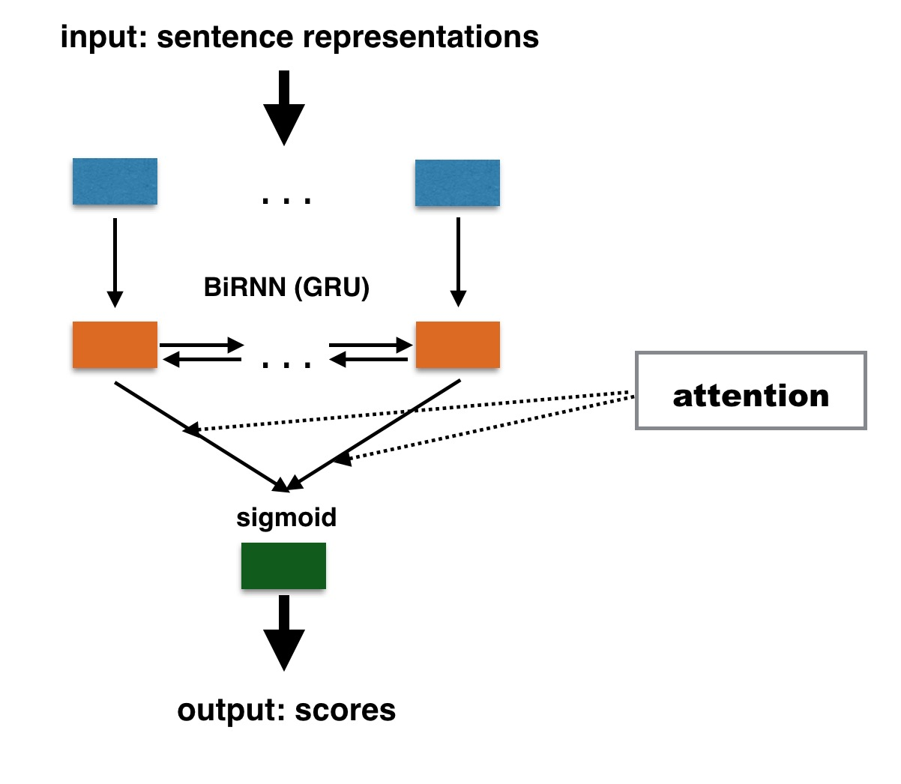

==================================
Introduction to Quality Estimation
==================================

Quality Estimation (QE) (`Specia et al. 2009`_) targets the prediction of MT quality without any human intervention.
QE results can be particularly useful during the costly Post-Edition (PE) process, the process of manually correcting MT output to achieve a publishable quality. 
QE indicates if an MT unit (*i.e.* a word, a phrase, a sentence, a paragraph or a document) is *worth post-editing*. 
For instance, sentence-level QE scores help to rank sentences that are worth post-editing, while word-level QE aims to spot words that need to be review during PE. 
Document-level QE, on the other hand, scores or ranks documents according to their quality for fully automated MT usage scenarios, where no post-editing can be performed, *e.g.* MT for gisting of online News articles.

The QE task is usually cast as a supervised regression or classification task, with a rather small amount of manually annotated or/and post-edited data. 
This data can be labelled using automatic metrics towards post-edited references. 
Whereas at the document, paragraph or sentence levels, QE predicts automatic scores (e.g., BLEU, TER, BEER, etc.), at the word and phrase levels predictions are often binary: *OK* or *BAD*.

.. _Specia et al. 2009: http://clg.wlv.ac.uk/papers/Specia_EAMT2009.pdf

******************************
Traditional Quality Estimation
******************************

For the document, paragraph and sentence levels, QE models are usually trained using various regression algorithms (e.g. Support Vector Machines (SVMs), Multilayer Perceptron). 
For the word and phrase levels, algorithms such as Conditional Random Fields (CRFs) or Random Forests are the most commonly used. 

QE features are traditionally characterized as *black-box* (system-independent) or *glass-box* (system-dependent, extracted from the translation process).
At word-level for instance, one can distinguish the part-of-speech and the lemma of a given word as system-independent features, and the system posterior probability of producing a certain word in a certain position as a glass-box feature. 

*******************************
Neural-based Quality Estimation
*******************************

Recently, neural-based methods have been successfully exploited to improve QE performances.
Those methods mostly rely on an encoder-decoder architecture (`Sutskever et al. 2014`_, `Bahdanau et al. 2015`_) for sequence-to-sequence prediction problems. 
This approach has become very popular in many applications, where inputs and outputs are sequential, as natural language data. 

In an encoder-decoder approach, an input sequence is encoded into an internal representation (roughly, features learned automatically), and then an output sequence is generated from this representation.
Current best practices implement encoder-decoder approaches using Recurrent Neural Networks (RNNs), which handle inputs in a sequence, while taking previous computation steps into account.
 
DeepQuest provides two different architectures, both based on the RNN encoder-decoder implementation: 

  **POSTECH architecture** (`Kim et al., 2017`_)

  This architecture is a two-stage end-to-end stacked neural QE model that combines a *Predictor* and an *Estimator* (`Kim et al., 2017`_):

  - *Predictor* is an encoder-decoder RNN model to predict words based on their important context representations. 
    To be more precise, it uses a modification of the standard NMT encoder-decoder architecture, which at each timestep predicts the next word :math:`e_i` taking into account not only the previously generated word :math:`e_{i-1}`, but also the following word :math:`e_{i+1}` (MT is given for the QE task).
    This Predictor architecture is pre-trained separately using a significant amount of parallel data; 

  - *Estimator* is which is a bidirectional RNN model to produce quality estimates for words, phrases and sentences based on representations from the Predictor, the so-called *QE feature vectors* (QEFVs).
    These QEFVs are extracted by decomposing the Predictor softmax layer and contain weights assigned by the Predictor to the words of actual MT we seek to evaluate. 

  Similarly to original work by (`Kim et al., 2017`_), DeepQuest also allows a stacked architecture for Multi-Task Learning (MTL), which consists in alternating between word-level predictions, and word, sentence, and phrase-level QE objectives, with one objective at a time.  

  **BiRNN architecture** (`Ive et al., 2018`_)

  The BiRNN architecture uses only two bi-directional RNNs (bi-RNN) with Gated Recurrent Units (GRUs) as encoders, to learn the representation of the <source, translation> sentence pair. 
  In DeepQuest, the representations of the source and of the automatic translation are learned independently, and concatenated afterwards, as illustrated below:

  .. image:: images/sent.jpg
    :align: center
    :height: 350px

  For word-level QE, the computed representation of a word can be used as is to make classification decisions.
  However, sentence-level QE scores are not simple aggregations of word-level representations: they reflect some importance of words within a sentence. Thus, a certain weighting should be applied to those representations. Such weighting is provided by the attention mechanism. 
  We apply the following attention function computing a normalized weight for each hidden state :math:`h_{j}` of the RNN:

  .. _equation:
  .. math:: \alpha_j = \frac{\exp(W_ah_j^\top)}{\sum_{k=1}^{J}\exp(W_ah_k^\top)}
   
  The resulting sentence vector is thus a weighted sum of word vectors:

  .. math:: v = \sum_{j=1}^{J}\alpha_j h_{j}

  This vector is then used to produce quality estimates.

**********************************************
Neural-based Document-Level Quality Estimation
**********************************************

DeepQuest is also suitable for neural-based document-level QE, for which a document representation is computed with RNNs (`Lin et al., 2015`_).
Here is an illustration of the document-level architecture implemented in DeepQuest:

This architecture is similar to the BiRNN architecture.
The document-level quality predictor takes as its input a set of sentence-level representations. 
The last hidden state of the decoder can be taken as the summary of an entire sequence. 
However, some document-level QE scores are not a simple aggregations of sentence-level QE scores. 
In such cases, DeepQuest provides an architecture using the attention mechanism (see equation_) to learn to weight different representations at sentence-level.
Finally, the last hidden state (or weighted sum) of the sentence-level representations is directly used to make classification decisions.
 

.. _Sutskever et al. 2014: https://arxiv.org/abs/1409.3215
.. _Bahdanau et al. 2015: https://arxiv.org/abs/1409.0473
.. _Kim et al., 2017: https://dl.acm.org/citation.cfm?id=3109480
.. _Ive et al., 2018: 
.. _Lin et al., 2015: http://aclweb.org/anthology/D15-1106
